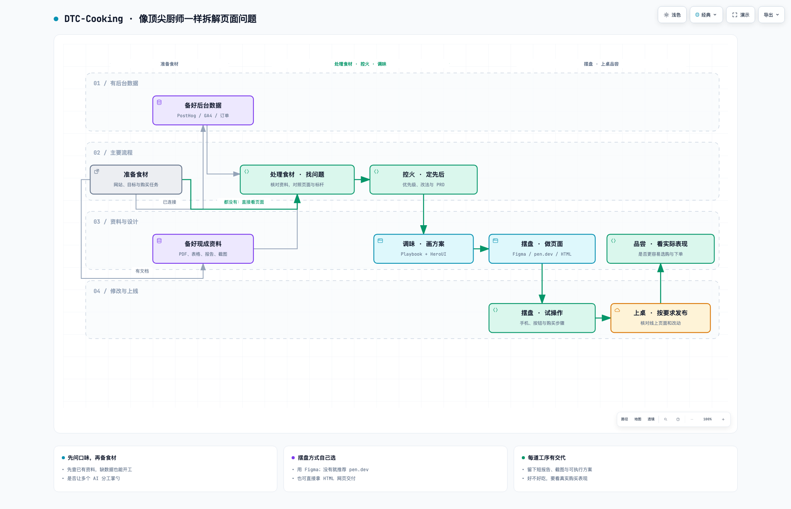

# DTC-Cooking：像顶尖厨师一样，拆解独立站的问题

> 版本 0.3.2｜这份说明解释 Skill 如何开展工作，不是某个站点已经改版、上线或提升转化的记录。

[交互流程图](workflow.html)（下载后用浏览器打开）

顶尖厨师会把一道菜拆成食材、处理方法、火候和味道，DTC-Cooking 则把独立站的问题拆成资料、页面体验、改进顺序和具体做法。我们借六道烹饪工序讲清整个流程，帮助顾客看懂商品、做出选择、顺利下单。每一步都要说明依据并留下能查看的成果。

优先推荐在 Codex 中使用：“使用 $dtc-cooking 检查这个商品页的手机端体验，给出修改方案，做好页面并上线。”Skill 的通用标识是小写 `dtc-cooking`，品牌名仍为 DTC-Cooking；Claude Code、Cursor 等环境按各自入口调用，见 [安装与跨 Agent 调用](../README.md#安装与跨-agent-调用)。只想找问题，就交付问题与方案；想改页面，就继续制作和验证；明确要求上线且条件具备，就推进到线上检查。小修只处理相关工序，不必从头跑完整流程。

## 1. 准备食材：手上有什么，就从什么开始

先摆清“食材”：你的网站、想帮助顾客完成的事情、现有资料，以及这次需要方案、预览还是上线。已经给过的信息不重复问。

完整流程启动时还会询问是否开启多智能体协作。开启后，可以让不同助手分别看资料、查标杆、写方案、做页面和验收，由主助手汇总；关闭也按同样标准完成。能独立做的事情并行，依赖上一步结论的事情按顺序做。

**第一条：已经连接后台。** 先检查 PostHog、GA4 或商城后台是否连接到正确站点，再读取与本次页面有关的信息，了解顾客在哪里犹豫或停止操作。只装了工具，不代表已经能读到这个站点的数据。

**第二条：没有连接，但有现成资料。** 可以建议连接已有的分析工具或商城后台；暂时不连接时，PDF、表格、经营报表、数据文档和截图都可以。先看清资料来自哪里、是什么时候、说的是哪个页面，再提取对方案有用的发现。不必为了开始检查而强制接入后台。

**第三条：什么资料都没有。** 直接检查用户的真实独立站，再选择相关跨品类标杆做对照。说明“你的页面现在怎样、标杆怎样处理、建议怎么改、为什么值得试”。这种路线可以提出明确方案，但不能把猜测写成真实流失原因，也不能编造提升比例。

这一步留下任务与资料说明，让你知道本次要解决什么、有哪些依据、哪些资料还没有。

## 2. 处理食材：分清可靠资料，找出真实问题

厨师会先处理食材，避免把不合适的部分混进菜里。这里先辨别资料的来源、日期和缺口，再实际打开页面，检查手机和电脑上的阅读、选商品、查看保障、加入购物车等过程。每个问题附上真实截图，说明看到了什么、可能怎样影响购买；推测和已确认的事实分开写。

标杆从可配置的公开清单按问题选择，例如参考 DJI 的商品比较、Anker 的场景选购、Casper 的购买保障。只选与本次问题有关的案例，不机械检查全部品牌。必须打开具体页面并保存真实截图，解释借鉴什么、哪里不适合照搬。

这一步留下问题清单、资料依据和页面对照截图，让你能看见判断从哪里来。

## 3. 控火：决定先改什么，这次做到哪里

火候不是越大越好，改动也不是越多越好。先处理挡住下单、让人误解商品或难以选择的问题，再结合证据和制作成本安排顺序。把本次范围控制清楚，避免为了换个外观重做整站。

这一步交付产品 PRD，也可以直接叫“页面改进说明书”：本次改哪里、发现什么问题、证据是什么、准备怎么改、如何判断做对了。

有数据就放相关资料和必要截图；没有数据就明确写“根据页面与标杆对照提出”。同时放入用户页面与标杆的真实截图，逐项解释建议。价格、优惠、保障和商品能力以用户确认的信息为准。

## 4. 调味：让信息、视觉和交互配合起来

调味要衬托食材，页面设计也要帮助顾客理解商品。按 Vibe Designing Playbook 的方法，安排信息顺序、主要按钮、手机和电脑的布局，以及加载或出错时的提示；再结合 HeroUI 的组件思路细化设计。沿用现有品牌和业务规则，说明每处调整如何帮助阅读、选择或操作。

这一步留下页面设计与组件说明，让改法具体到文字、区块、按钮和状态。

## 5. 摆盘：做成能用的网页，也方便继续修改

摆盘要让人知道从哪里开始吃，网页也要让人看得懂、点得动。把设计做成可运行页面，实际点击和操作，检查手机和电脑上的商品信息、按钮、购物车及相关购买流程。需要记录顾客操作时，确认记录能被后台收到。

网页预览完成后，让用户选择交付方式：有 Figma，可以导入可编辑设计稿；使用 Codex 时先检查 Figma 插件，缺少时提示安装并验证连接，再按用户选择导入。没有 Figma 但想自己调整，推荐 [pen.dev 客户端](https://www.pen.dev/)；也可以直接交付 HTML + Tailwind CSS。

pen.dev 支持导入网页、手动修改和导出页面代码，适合调整文字、图片与排版，但不能把导出页面当成已经接好全部购买功能。用户修改后，要重新检查手机、电脑上的展示和关键操作。

这一步交付网页预览、代码或可编辑稿，以及实际检查结果和前后对比。只看到“构建成功”或预览正常，不能说明线上页面已经可用。

## 6. 上桌品尝：按要求上线，用实际表现判断效果

做好页面后，按已有授权发布：先核对正确站点与发布目标，发布后重新检查线上页面，并留下恢复旧版本的方法。缺少必要授权或账号访问时，说清还差什么；能独立完成的准备继续做，不重复询问已经明确授权的同一操作。

上桌不代表人人都喜欢，页面上线也不代表已经提高转化。后续用可比较的数据或资料观察顾客是否更容易完成关键操作，再判断改动有没有帮助；尚无数据时明确说明效果待验证。这一步留下线上检查、恢复说明，以及实际有依据的效果判断。

## 每道实际执行的工序，都留下能查看的结果

准备食材有任务说明，处理食材有研究和截图，控火有改进说明书，调味有设计说明，摆盘有网页和检查结果，上桌品尝有线上核验。报告可以合并成几个清楚的章节，先回答“做了什么、发现什么、建议什么、还有什么没确认”，配上必要截图和结果链接。不为未执行的步骤生成空报告，也不把报告变成额外审批。

参考：[Vibe Designing Playbook](https://alibaba-cloud-design.github.io/vibe-designing-playbook/)、[HeroUI](https://www.heroui.com/)、[公开标杆研究起点](../dtc-cooking/references/benchmarks.md)。
